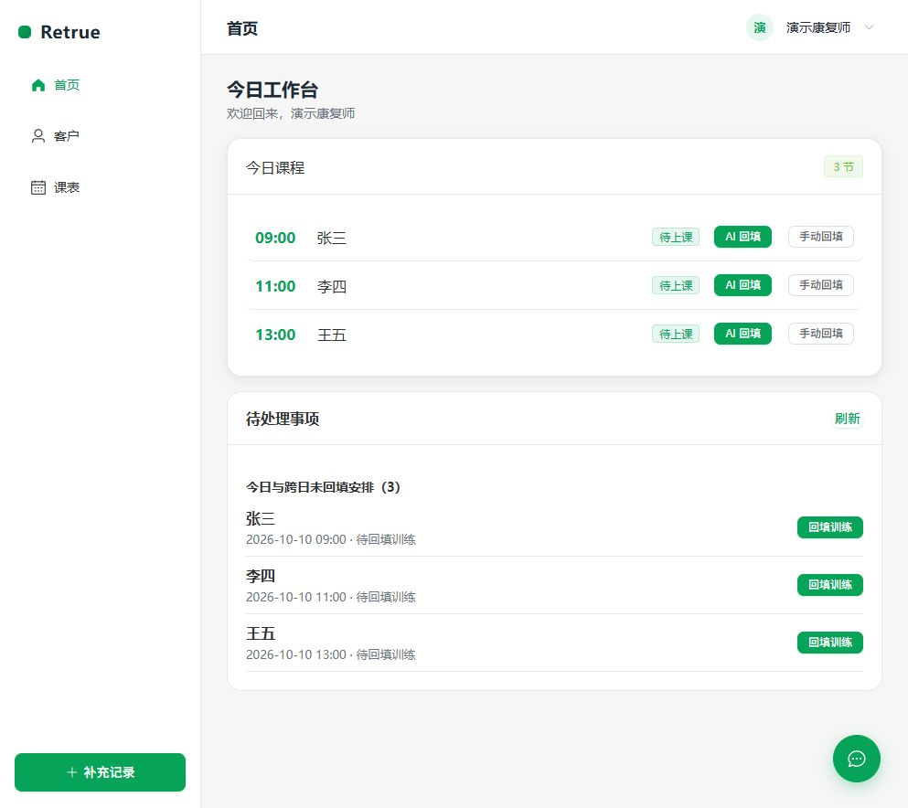
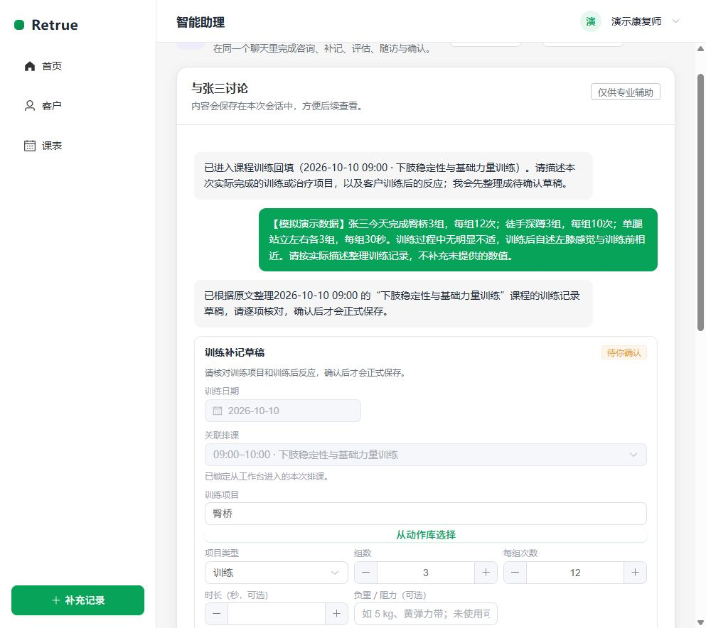
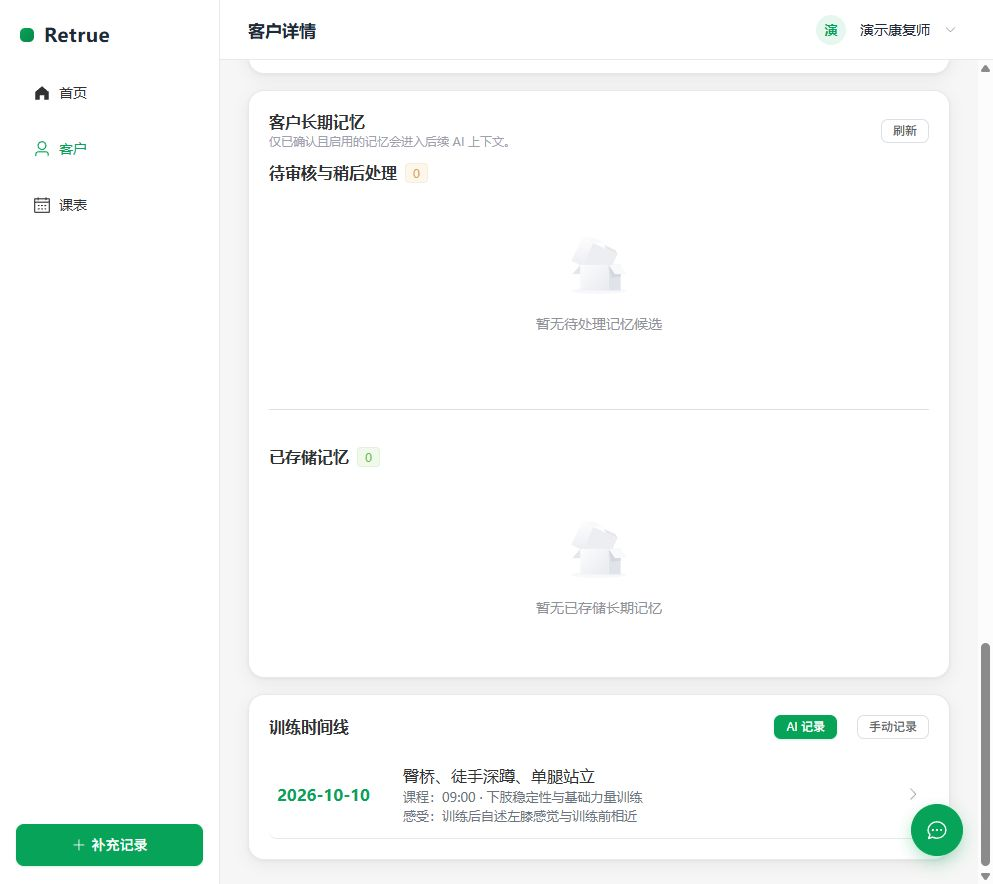

# Retrue｜运动康复智能工作台

Retrue 是面向运动康复师的 AI 工作台，将客户档案、课程安排、训练记录和后续备课串成完整工作流。康复师可以用自然语言描述训练过程，由 AI 整理为可编辑草稿，审核后保存为正式记录，并关联课程状态和客户时间线。

项目关注日常记录、备课与复盘的衔接。涉及业务数据变更的 AI 输出先形成草稿，正式写入必须经过康复师确认；客户查询和专业问答可直接返回辅助回复。

> 这是一个持续迭代中的个人项目，不是医疗诊断或治疗建议系统。请勿在公开环境中导入真实客户健康信息。

## 产品演示

以下截图来自本地运行的应用，使用独立展示账号和张三、李四、王五等模拟客户。训练描述、课程计划和客户反应均为虚构演示数据，不构成训练或治疗建议。

**今日工作台：从课程进入训练补记**



**AI 训练草稿：保留原始描述，由康复师逐项核对**



**客户时间线：确认后的训练记录进入客户档案**



完整演示路线为：今日课程 → 输入实际训练描述 → 核对草稿 → 确认保存 → 查看客户时间线与课程状态。人工编辑及确认界面见[确认截图](docs/images/showcase-ai-confirmation.jpg)，课程状态变化见[完成后工作台](docs/images/showcase-course-completed.jpg)。本次实测及发现的问题见[展示验证记录](docs/showcase-validation.md)。

## 为什么做这个项目

运动康复的日常工作常在课表、客户信息、训练笔记和后续备课之间来回切换。Retrue 围绕一条明确的业务闭环设计：

```text
今日课程 → 记录训练 → AI 整理草稿 → 人工确认 → 客户时间线 → 下次备课
```

在此基础上，课程计划、计划内课程、具体排期与正式训练记录保持关联，减少“已上课但记录和课时状态不同步”的问题。

## 主要能力

| 场景 | 当前能力 |
| --- | --- |
| 客户与评估 | 客户档案、首次评估与复评草稿/完成状态、客户时间线与数据隔离。 |
| 课程与课表 | 课程计划、课程模板、批量排课预览与确认、时间冲突校验、课程状态与课时流水。 |
| 训练记录 | 手动录入训练内容；正式保存后关联课程完成状态，并保留可追溯的记录。 |
| AI 工作台 | 训练补记、客户查询、专业问答、评估/随访草稿等统一任务入口，支持进度事件和中断后继续处理。 |
| 安全边界 | 涉及业务变更的 AI 输出先进入草稿或等待确认状态；身份不确定时要求选择客户；正式写入、权限和审计由后端领域服务控制。 |
| 知识与动作 | 客户私有知识库、动作库与家庭训练等业务模块。 |
| 日常交付 | 历史未补记课程、待确认草稿与回访待办；家庭训练编辑及完整文案复制；动作与客户别称维护。 |
| 数据管理 | 按当前康复师权限导出客户正式记录、查看删除影响预览；删除执行规则尚待确认。 |

## 关键工程问题与实现

| 问题 | 实现方式 | 代码与说明 |
| --- | --- | --- |
| 自然语言中的客户可能同名或使用别称 | 在当前康复师范围内解析最小客户目录，歧义时等待选择；读取客户上下文前校验归属 | [客户目录解析](retrue-server/apps/customers/catalog.py) |
| AI 工作需要查询、追问和等待人工确认 | LangGraph 编排意图分支与等待节点，Django 领域服务负责权限和正式写入 | [编排图](retrue-server/apps/ai/orchestration/graph.py)、[系统架构](docs/architecture.md) |
| 刷新或重复请求可能造成重复执行 | 持久任务记录恢复位置，执行尝试校验拒绝过期结果，草稿确认按既有记录返回 | [执行生命周期](retrue-server/apps/ai/orchestration/execution.py)、[草稿确认](retrue-server/apps/ai/services/training_parser.py) |
| 训练记录、课程完成与课时消耗需要一致 | 通过事务和锁维护正式确认后的课程状态与课时流水 | [训练服务](retrue-server/apps/training/services.py)、[课程服务](retrue-server/apps/schedules/services.py) |

### 核心设计取舍

- **人工确认优先**：模型不直接修改正式训练记录、评估、课时或风险处理结果。
- **先校验身份和权限，再读取上下文**：客户识别不明确时不自动猜测，也不提前暴露客户资料。
- **业务状态由服务端维护**：前端展示不决定课程是否完成、课时是否扣减或记录是否可写入。
- **单体优先**：V1 使用 Django 单体和 PostgreSQL，优先验证业务闭环，不预建微服务、消息队列或 Redis 等额外基础设施。

详细的业务规则与边界见 [产品设计文档](docs/Retrue_项目设计文档_V1.0.md)；课程计划到训练记录的关联关系见 [系统架构](docs/architecture.md)。

## 技术栈

- 前端：Vue 3、TypeScript、Vite、Pinia、Element Plus
- 后端：Django、Django REST Framework、Pydantic
- 数据库：PostgreSQL + pgvector
- AI 编排：LangGraph；模型服务通过配置切换，默认可使用 mock provider 本地开发
- 部署：前端静态文件由 Nginx 提供；Docker 运行 Django ASGI 后端，PostgreSQL 保持在宿主机

## 架构概览

```text
Vue 3 Web
    │ REST API / SSE
    ▼
Django + DRF
    ├── 客户、评估、课程、训练与审计等领域模块
    ├── LangGraph AI 编排（草稿与等待确认）
    └── Django Admin
    │
    ▼
PostgreSQL + pgvector
```

```text
RehabPlan → RehabPlanCourse → CourseSession → TrainingRecord
客户计划     计划内课程          具体排期          正式训练记录
```

## 实现与验证状态

- 当前已有客户管理、课程计划与排课、训练记录、AI 草稿确认和客户时间线等实现。
- [2026-10-04 独立验证记录](docs/plans/2026-10-04-remediation-verification.md)记载：514 项后端测试、11 项前端测试、类型检查和生产构建通过。该记录使用临时 PostgreSQL 测试库与 mock 模型，是历史验证结果。
- 本次本地展示的浏览器操作与数据库结果单独记录在[展示验证记录](docs/showcase-validation.md)，不等同于全量 E2E 或生产验收。
- 删除执行规则、部分旧 AI 入口编排收口、真实部署与容量验收仍有待推进，详见上述验证记录。内置语音功能不在实现范围内。

## 快速开始（本地开发）

### 前置条件

- Python 3.12+（项目依赖 Django 5.2+）
- Node.js 24（与项目测试和 CI 配置一致）
- 可连接的 PostgreSQL 数据库，并启用 `pgvector` 扩展

### 1. 配置后端环境

在 `retrue-server` 下复制环境变量示例并填入本地数据库信息。请勿提交实际 `.env` 文件或任何模型密钥。

```powershell
cd retrue-server
Copy-Item .env.example .env
```

使用项目的虚拟环境安装依赖并执行迁移：

```powershell
python -m venv .venv
.venv\Scripts\python.exe -m pip install -r requirements-lock.txt
.venv\Scripts\python.exe manage.py migrate
```

若只做不接入真实模型的本地演示，请在 `retrue-server/.env` 中显式加入 `AI_CONFIG_FILE=`，以禁用默认 YAML 模型配置并使用示例文件中的 `AI_PROVIDER=mock`。接入真实模型前，再按 `ai_config.yaml` 和环境变量配置对应密钥。

可选：只为本地演示创建示例数据。该命令会创建固定的开发账号；不要在联网或生产环境执行。

```powershell
.venv\Scripts\python.exe manage.py init_demo_data
```

该命令生成的本地演示账号为 `retrue / retrue123`。它会重置已有同名演示账号的密码，只能在专用本地演示环境使用。公开截图使用的独立展示账号不包含在仓库中。

启动后端：

```powershell
.venv\Scripts\python.exe manage.py runserver
```

健康检查地址：`http://127.0.0.1:8000/api/health/`

业务依赖就绪检查：`http://127.0.0.1:8000/api/readiness/`。它检查数据库、迁移、登录缓存表、vector 扩展和模型配置；不会调用真实模型，200 不代表真实模型或生产链路已验收。

### 2. 启动前端

另开一个终端：

```powershell
cd retrue-web
npm ci
npm run dev
```

按终端输出的本地地址打开应用（通常是 `http://localhost:5173`）。按上一步启用 mock provider 后，无需真实模型密钥也可以浏览本地演示流程。

辅助记忆任务消费、课程目录初始化和独立验证命令见[本地开发说明](docs/local-development.md)。

## 文档导航

| 文档 | 内容 |
| --- | --- |
| [产品设计文档](docs/Retrue_项目设计文档_V1.0.md) | 产品定位、业务规则、AI 边界与数据模型。 |
| [系统架构](docs/architecture.md) | V1 架构、模块职责、课程闭环和 AI 数据流。 |
| [API 文档](docs/api/README.md) | 接口文档约定及各模块 API。 |
| [数据库文档](docs/database/README.md) | 表结构、迁移和初始化数据约定。 |
| [部署说明](DEPLOY.md) | 宿主机 PostgreSQL/Nginx 与 Django 容器的发布流程。 |
| [贡献指南](CONTRIBUTING.md) | 协作前提与提交前检查。 |
| [本地开发说明](docs/local-development.md) | 辅助任务、目录初始化和独立验证入口。 |
| [展示验证记录](docs/showcase-validation.md) | 本次截图来源、实际操作结果和验证边界。 |

## 项目结构

```text
.
├── retrue-web/       # Vue 前端
├── retrue-server/    # Django 后端与 AI 编排
├── docs/             # 产品、架构、API 与数据库文档
├── DEPLOY.md         # 生产部署说明
└── AGENT.md          # 代码与数据协作约束
```

## 贡献与安全

欢迎通过 Issue 或 Pull Request 讨论改进。在提交前请特别确认：

- 不包含 `.env`、密钥、真实客户数据、部署地址或构建产物；
- AI 相关改动仍保留“草稿 → 人工确认 → 正式写入”的边界；
- 接口、数据表变更同步更新对应前后端代码与文档；
- 至少运行与改动相关的后端检查/测试和前端构建。

具体约定见 [CONTRIBUTING.md](CONTRIBUTING.md) 与 [AGENT.md](AGENT.md)。
